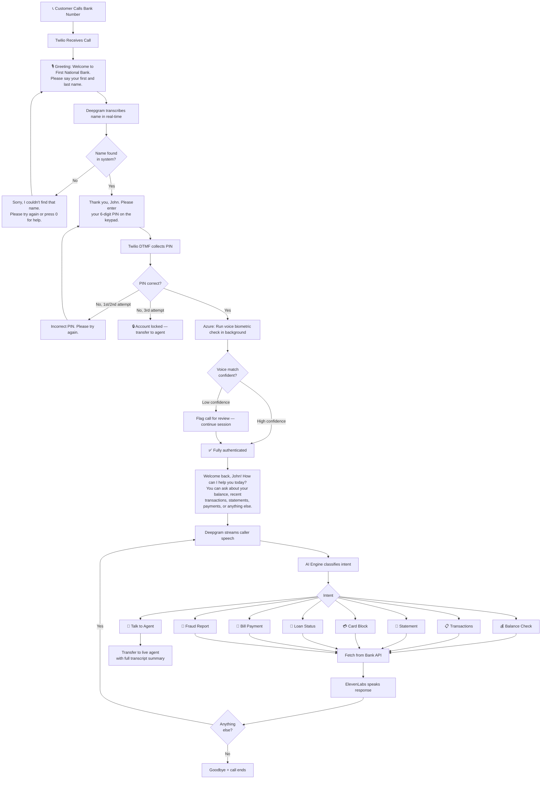
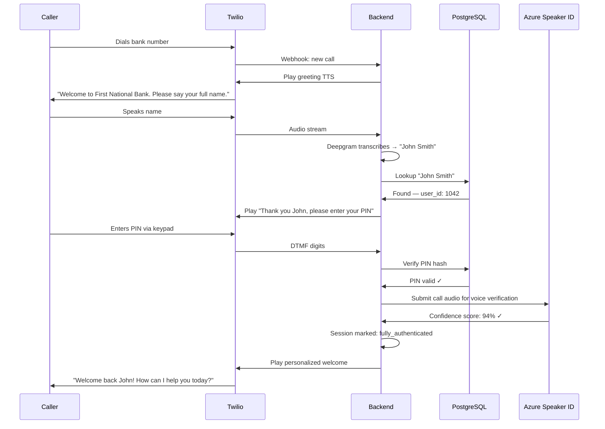

# Call Flow

## Inbound Call — Full Journey

## Authentication Detail

## Intent Routing Keywords

| Intent | Example Phrases |
|---|---|
| Balance Check | "balance", "how much do I have", "account balance", "funds available" |
| Transactions | "transactions", "recent activity", "what did I spend", "last payments" |
| Statement | "statement", "monthly statement", "PDF", "email my statement" |
| Bill Payment | "pay bill", "pay electricity", "schedule payment", "make a payment" |
| Card Block | "block my card", "lost card", "stolen card", "freeze card", "card missing" |
| Loan Status | "loan", "EMI", "how much is left", "loan balance", "repayment" |
| Fraud Report | "unauthorized", "fraud", "I didn't make this", "dispute", "suspicious" |
| Live Agent | "agent", "human", "talk to someone", "real person", "representative" |
